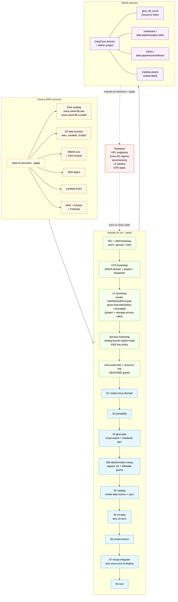

# SageMaker Unified Studio Migration Toolkit

A complete toolkit for migrating an existing AWS analytics estate into [Amazon SageMaker Unified Studio (SMUS)](https://docs.aws.amazon.com/sagemaker-unified-studio/latest/userguide/) — domain creation, Glue jobs, Glue Data Catalog assets, S3 data, MWAA DAGs, and CI/CD wiring — with a paired sandbox provisioner for end-to-end testing in a clean account.

## Objective

Bring an account's analytics surface (Glue, S3 data, MWAA, Lake Formation, related connectivity) into a governed SMUS domain in one repeatable run, while preserving the original IAM identities, scripts, and DAGs as code under your own version control.

> **This toolkit is a reference sample, not a turnkey product.** It's intended to help you learn how SMUS migration works end-to-end and to plan your own migration — read the scripts, run them against a sandbox account, adapt the per-step bash to your real source estate, and lift the patterns into your own tooling. Treat the bootstraps and step scripts as worked examples of the AWS API calls, IAM/LF/KMS configuration, and SMUS-specific gotchas you'll encounter, not as a black box to point at production.

## Why this matters

If you already run analytics on AWS today, lifting it into SMUS by hand is a multi-week ticket-driven exercise: domain bootstrap, project profiles, blueprints, IDC wiring, Glue catalog publishing, Lake Formation grants, MWAA migration, CodeCommit/GitHub plumbing, and Spark session compatibility — every one with its own gotchas. This toolkit collapses that into a deterministic apply-mode run.

It helps customers who want to:

- **Adopt SMUS without re-platforming.** External Glue jobs, S3 buckets, MWAA DAGs, and Glue connections are migrated as data assets and code, not rewritten.
- **Get governed access in one pass.** Lake Formation hybrid mode, IAMAllowedPrincipals cleanup, project user role grants (Describe/Select +Grantable), manage-access role grants, KMS key access for Spark logs, and self-subscription to Glue assets all happen in one bootstrap chain.
- **Test the migration before doing it for real.** A paired Seed Script provisions a representative source account (Glue, RDS, MSK, Kinesis, Firehose, SNS, Lambda, CloudWatch, MWAA) so you can rehearse the whole thing in dev before pointing it at production.
- **Tear it all down and start over.** Hardened teardown handles the five known SMUS deletion failure modes (lingering VPC endpoints, cross-SG ingress rules, env stack drain, dangling LF admins, stuck DataZone Owner CFN resource) so you can iterate without manual EC2 / IAM / LF cleanup.

## What's in the box

There are four entry-point scripts. Two stand up source-side data; two move it into SMUS.

| Script | Purpose |
|---|---|
| `seed.sh` | Provisions a representative source-account analytics surface (Glue + RDS + MSK + Kinesis + Firehose + SNS + Lambda + CloudWatch + MWAA) so you have something realistic to migrate. |
| `nuke.sh` | Audits AWS directly and tears down every resource matching the seed prefix. Use this to wipe the seed account back to empty. |
| `migrate.sh run` | Runs the migration. Bootstraps SMUS infrastructure (IDC, IAM, CFN), then walks the migration tool through 9 steps that stand up the SMUS domain and migrate Glue, S3, and MWAA. |
| `migrate.sh teardown` | Reverses everything `migrate.sh run` did, including hardening passes for the SMUS-specific deletion gotchas. |

## What `seed.sh` does

`seed.sh` is the source-account provisioner. It dispatches per-service modules under `./seed/<service>/{create,teardown}.sh` in canonical order so a single command brings up the whole surface or tears it back down. Default mode is dry-run; pass `--apply` to actually create AWS resources.

The thirteen-step provision sequence is fixed:

```
network → glue(foundation) → rds → glue(rds-bridge) → sns → msk → kinesis
       → data-gen → firehose → glue(crawler) → glue(kafka)
       → lambda → cloudwatch → mwaa
```

Glue is dispatched four times across phases so jobs can run against real RDS data **before** the crawler creates catalog tables. This produces a Glue Data Catalog with two databases (`smus-seed-db-raw`, `smus-seed-db-curated`) and six tables — a realistic stand-in for an existing customer's data lake.

The Seed Script is fully self-contained:

- Its own config file at `./seed/seed.config.json` (bootstrapped on first run from `seed.config.json.example`).
- Its own state file at `./seed/seed.state.json` (records every provisioned resource ID).
- Its own logs at `./seed/logs/`.
- Its own helper library at `./seed/_lib/`.
- Its own env-var prefix `SBX_*`.

It never writes the migration tool's config or state files. The only permitted Seed → Migration interaction is reading `./config/migration.config.json` to enforce the same-account contract (Seed and Migration must target the same AWS account).

## What `migrate.sh run` does

`migrate.sh run` is a wrapper around `python -m migration_tool` that adds:

1. **Pre-step bootstraps.** Idempotent setup of SMUS-adjacent infrastructure that lives outside the migration tool's per-step scripts — IDC users/groups, IAM roles, CloudFormation stack for the SMUS domain + project, Lake Formation grants, KMS key access, asset auto-subscription, resource-link DESCRIBE grants. Each helper short-circuits on dry-run, runs idempotently in apply mode.
2. **Migration tool dispatch.** Calls the Python orchestrator with the right `--set` overrides pre-injected so the run doesn't pause for prompts already answered by the bootstrap helpers.
3. **Hardened teardown.** A symmetric `migrate.sh teardown` walks the bootstrap chain in reverse with the failure-mode patches we've learned the hard way.

The migration tool itself runs nine canonical steps:

| # | ID | What it does |
|---|---|---|
| 1 | `01_create-smus-domain` | Wires IDC, deploys the SMUS domain CFN stack, creates the Admin Project, registers the Git connection. |
| 2 | `02_portability` | Classifies every service as Full/Inventory-only/Excluded and writes `portability-report.json`. |
| 3 | `03_glue-jobs` | Exports every Glue job script, generates SMUS-compatible notebooks, commits to `data-pipelines/glue-jobs/`. |
| 3b | `03b_lakeformation-setup` | Adds LF admins, registers S3 locations in hybrid mode, grants per-DB and per-table permissions. |
| 4 | `04_catalog` | Creates a Glue-type DataZone data source, triggers the initial sync to publish tables as assets. |
| 5 | `05_s3-data` | Builds the candidate-bucket list (Glue jobs + catalog locations + MWAA buckets minus DAG bucket) and `aws s3 sync`s into the SMUS-managed location. |
| 6 | `06_mwaa-extract` | Pulls DAGs, plugins, requirements out of the source MWAA bucket; commits DAGs to `data-pipelines/workflows/dags/`. |
| 7 | `07_mwaa-integrate` | Generates `manifest.yaml` and runs `aws-smus-cicd-cli deploy` against the Admin Project's MWAA. |
| 8 | `08_dag-yaml` | (Gated by `--convert-dags`.) AST-scans DAGs against the Airflow→YAML allowlist and converts the convertible ones. |
| 9 | `09_cicd` | Emits the provider-native pipeline file (`deploy.yml` / `.gitlab-ci.yml` / `bitbucket-pipelines.yml`) plus aggregated CI/CD manifest. For CodeCommit, writes `MANUAL-CI-WIRING.md` and stops short of pushing. |

Default is dry-run. Pass `--apply` to actually execute AWS calls and commits.

## Migration flow



## Quick start

The end-to-end loop you'll run repeatedly:

```bash
./seed.sh provision --apply --profile smus-seed       # stand up source data
./migrate.sh run --apply --profile smus-seed --yes    # migrate it into SMUS
# … verify in the SMUS portal …
./migrate.sh teardown --apply --profile smus-seed --yes  # remove SMUS layer
./nuke.sh --apply --profile smus-seed --yes           # wipe seed account
```

Each script defaults to dry-run, so you can preview without touching AWS by leaving off `--apply`.

### `seed.sh`

Provision the source-side analytics surface:

```bash
# Preview (no AWS calls)
./seed.sh provision --profile smus-seed

# Apply — full canonical sequence
./seed.sh provision --apply --profile smus-seed

# Apply only specific services (e.g. skip MWAA in CI to save 25 min)
./seed.sh provision --apply --skip-mwaa --profile smus-seed

# Apply only Glue + RDS
./seed.sh provision --apply --glue --rds --profile smus-seed

# Inspect current state
./seed.sh status --profile smus-seed

# Tear down everything
./seed.sh teardown --apply --profile smus-seed
```

Flags:
- `--apply` / `--dry-run` (default dry-run; mutually exclusive)
- `--profile NAME` AWS CLI profile (or set `AWS_PROFILE`)
- `--region NAME` override region (defaults from `seed/seed.config.json`)
- `--all` (default) or per-service flags `--network`, `--glue`, `--rds`, `--sns`, `--msk`, `--kinesis`, `--data-gen`, `--firehose`, `--lambda`, `--cloudwatch`, `--mwaa`
- `--skip <service>` exclude one service from `--all`

### `migrate.sh`

Stand up SMUS and run the migration:

```bash
# Preview
./migrate.sh run --dry-run --profile smus-seed

# Apply — full migration end-to-end
./migrate.sh run --apply --yes --profile smus-seed

# Re-run a single step (e.g. notebook generation)
./migrate.sh run --apply --yes --profile smus-seed -- --force 03_glue-jobs

# Run a contiguous range
./migrate.sh run --apply --yes --profile smus-seed -- --from 03_glue-jobs --to 06_mwaa-extract

# Include the optional Python DAG → YAML conversion (Step 8)
./migrate.sh run --apply --yes --profile smus-seed -- --convert-dags

# Inspect run state
./migrate.sh status

# Reset just the migration state file (does NOT touch AWS)
./migrate.sh reset --yes
```

Flags:
- `--apply` / `--dry-run` (default dry-run; mutually exclusive)
- `--profile NAME` AWS CLI profile
- `--region NAME` override region
- `--yes` skip the apply-mode confirmation prompt
- `-- <args>` everything after `--` is forwarded to `python -m migration_tool` (use this for `--from`, `--to`, `--step`, `--force`, `--reset`, `--convert-dags`, `--set k=v`)

### `migrate.sh teardown`

Reverse everything `migrate.sh run` did:

```bash
# Preview
./migrate.sh teardown --dry-run --profile smus-seed

# Apply (full unwind, deletes the CFN stack)
./migrate.sh teardown --apply --yes --profile smus-seed

# Apply but keep the CFN stack (e.g. only undo LF/KMS/IAM tweaks)
./migrate.sh teardown --apply --yes --keep-cfn --profile smus-seed

# Apply but keep the project user role's inline IAM policies
./migrate.sh teardown --apply --yes --keep-iam-roles --profile smus-seed
```

What teardown does, in order:

1. Cancel/revoke every active subscription the admin project holds.
2. Revoke the LF DESCRIBE grants we added on resource links and the project DB.
3. Remove the `AllowProjectUserRoleForSparkLogs` statement from the tooling-bucket KMS key policy.
4. Detach the Step 3 inline IAM policies (`GlueSparkLogsAccess`, `GlueDataBucketAccess`, `GlueConnectionAccess`).
5. Delete the SMUS CFN stack with the **five hardening passes** built in:
    - Drain SMUS-managed VPC interface endpoints from the Tooling SG.
    - Revoke cross-SG ingress rules referencing the Tooling SG.
    - Drive each DataZone environment to fully GONE before parent delete.
    - Strip dangling principals (project user roles whose IAM role is gone) from the LF data-lake admins list.
    - Retry the domain sub-stack delete with `--retain-resources rSUSDomainOwnerIAMRole` if the DataZone Owner CFN resource gets stuck on `ConditionalCheckFailed`.
6. Wipe the migration state file.

Flags:
- `--apply` / `--dry-run` (default dry-run; mutually exclusive)
- `--profile NAME` AWS CLI profile
- `--yes` skip the confirmation prompt (otherwise type `teardown` to confirm)
- `--keep-cfn` skip step 5
- `--keep-iam-roles` skip step 4

### `nuke.sh`

Wipe the source account back to empty (audits AWS directly, ignores the seed state file):

```bash
# Preview
./nuke.sh --dry-run --profile smus-seed

# Apply
./nuke.sh --apply --yes --profile smus-seed

# Override prefix or region (defaults from seed.config.json)
./nuke.sh --apply --yes --profile smus-seed --prefix smus-mig-seed --region us-east-1
```

Flags:
- `--apply` / `--dry-run` (default dry-run; mutually exclusive)
- `--profile NAME` AWS CLI profile (required unless `AWS_PROFILE` is set)
- `--region NAME` override region
- `--prefix NAME` override the resource-name prefix to match
- `--yes` skip confirmation

## Project layout

```
.
├── migration_tool/      # Python orchestrator (CLI, config, state, runner, logger, redact, reports)
├── steps/               # Per-step bash scripts (steps/<NN_kebab-name>/run.sh)
│   ├── 01_create-smus-domain/
│   ├── 02_portability/
│   ├── 03_glue-jobs/
│   ├── 03b_lakeformation-setup/
│   ├── 04_catalog/
│   ├── 05_s3-data/
│   ├── 06_mwaa-extract/
│   ├── 07_mwaa-integrate/
│   ├── 08_dag-yaml/
│   ├── 09_cicd/
│   └── inventory/<service>/
├── cfn/                 # CloudFormation templates deployed by migrate.sh's _cfn_bootstrap
├── data-pipelines/      # Migrated artifacts (notebooks, DAGs, scripts) — committed by Steps 3 / 6 / 8
├── seed/                # Self-contained Seed Script (own config, state, logs, helpers)
│   ├── glue/, rds/, msk/, kinesis/, firehose/, sns/, lambda/, cloudwatch/, mwaa/, network/
│   ├── seed.config.json.example
│   ├── seed.state.json.example
│   └── _lib/common.sh
├── config/              # migration.config.json — user inputs persisted here
├── state/               # migration.state.json — per-step status persisted here
├── logs/                # logs/run-<UTC>.log — one file per CLI invocation
├── docs/cache/          # Cached AWS Documentation MCP fetches
├── tests/               # tests/unit/, tests/property/, tests/integration/
├── seed.sh              # Seed Script entry point
├── nuke.sh              # Source-account wipe
└── migrate.sh           # Migration entry point + teardown counterpart
```

## Dry-run vs apply semantics

- **Default is dry-run.** Without `--apply`, every script reads state, prints what it would run, prints what it would write, and changes nothing in AWS or in your code repository.
- **`--apply` is required for state-changing operations.** Domain creation, repository creation, `aws datazone create-*`, `aws s3 sync`, `git commit`, `git push`, KMS / LF mutations — all of it runs only when `--apply` is passed.
- **`--apply` and `--dry-run` together exit non-zero.** Mutually exclusive, by design.
- **`--yes` skips the apply-mode confirmation prompt.** Use this in CI; without it, the script asks the operator to type the action verb on stdin to confirm.

## Hybrid architecture

The migration tool is a thin Python orchestrator paired with per-step bash scripts:

- **Python orchestrator** (`migration_tool/`) — sequencing, interactive prompts, configuration persistence, state tracking, idempotency, output parsing, redaction, logging, end-of-run reporting.
- **Bash step scripts** (`steps/<NN_kebab-name>/run.sh`) — every AWS interaction. Each script issues `aws ...` invocations and emits `STATUS:` lines that the orchestrator parses.

**AWS CLI is the command surface.** No `boto3` or other AWS Python SDK is used in the orchestrator for any operation that targets a source-account or SMUS resource. Provider-specific tools — `git`, `git-remote-codecommit`, `aws-smus-cicd-cli`, `python-to-yaml-dag-converter-mwaa-serverless`, and pipeline linters — are invoked as subprocesses from bash scripts.

## Supported `repo_provider` values

The tool supports the six Git providers that SMUS Git connections accept:

- `codecommit` — AWS CodeCommit. The repository is auto-created by Step 1 and registered as a CodeCommit-typed Git connection on the Admin Project.
- `github` — GitHub.com.
- `github-enterprise-server` — GitHub Enterprise Server (self-hosted).
- `gitlab` — GitLab.com.
- `gitlab-self-managed` — GitLab self-managed (self-hosted).
- `bitbucket` — Bitbucket Cloud.

Any other value is rejected. The repository URL prompt is skipped for `codecommit` (Step 1 fills `repo_url` from `cloneUrlHttp`); other providers are validated against a provider-specific regex.

## Reference document

The canonical reference for AWS-recommended approaches is `SageMaker Unified Studio - Migration Answers.md` at the repository root. Two sections drive specific design decisions:

- **Section "2. Git Connections"** — source of truth for the six supported `repo_provider` values and the connection types the tool registers via `aws datazone create-connection`.
- **Section "4. Best Path to Bring Existing Datasets, Glue Jobs, and ML Assets"** — source of truth for the Glue connection onboarding pattern (treat connection metadata as portable in place; register each Glue connection as a SMUS_Connection on the Admin Project).

Each Step_Module README also cites at least one URL fetched and cached from the AWS Documentation MCP server (`docs/cache/`).
